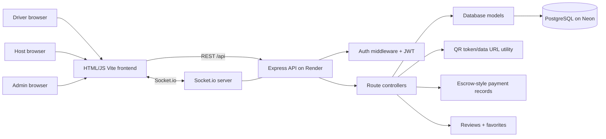

# ParkSlot — Peer-to-Peer Smart Parking Marketplace

ParkSlot connects drivers with verified parking spaces listed by hosts. Features include live slot availability via Socket.io, Leaflet/OpenStreetMap maps, QR-based check-in/check-out, escrow-style mock payments, EV charger metadata, saved listings, reviews, and admin approval.

## Tech Stack

- **Frontend:** Plain HTML5 + vanilla JS, Vite bundler, multi-page (no SPA framework), Leaflet + OpenStreetMap + Nominatim, Socket.io client
- **Backend:** Node.js, Express, Socket.io, PostgreSQL (via Neon)
- **Auth:** JWT (jsonwebtoken) + bcrypt password hashing
- **Database:** PostgreSQL — schema in `database/schema.sql` (no seed file; see below)

## Project Layout

```
backend/    Express API, Socket.io, route controllers, models, middleware
database/   PostgreSQL schema (schema.sql)
frontend/   HTML pages, vanilla JS modules, CSS, Vite config
```

## Run Locally

### 1. Prerequisites

- Node.js 18+
- A PostgreSQL database (local install, or a free cloud instance on [Neon](https://neon.tech))

### 2. Database

Apply the schema against your database:

```bash
psql "$DATABASE_URL" -f database/schema.sql
```

There is no seed file. To test locally, sign up through the UI, then manually set `role = 'admin'` for your admin account in the DB if needed:

```sql
UPDATE users SET role = 'admin' WHERE email = 'you@example.com';
```

After deploying to Neon for the first time, also run the `ALTER TABLE` migration if the column isn't in your live schema yet:

```sql
ALTER TABLE users ADD COLUMN IF NOT EXISTS is_suspended BOOLEAN NOT NULL DEFAULT false;
```

### 3. Backend

```bash
cd backend
npm install
cp .env.example .env   # fill in your values
npm start
```

Key environment variables (see `backend/.env.example` for full list):

| Variable | Description |
|---|---|
| `DATABASE_URL` | Postgres connection string (Neon or local) |
| `JWT_SECRET` | Long random string for JWT signing |
| `CORS_ORIGIN` | Frontend origin(s), comma-separated |
| `PORT` | API port (default 5000) |
| `PLATFORM_COMMISSION_PERCENT` | Host payout commission (default 15) |

### 4. Frontend

```bash
cd frontend
npm install
npm run dev          # dev server with /api proxy to localhost:5000
npm run preview      # test the production build locally (use this before pushing)
```

Set `VITE_API_URL=https://your-render-url.onrender.com/api` in Vercel environment variables so the built frontend hits the deployed backend.

## System Architecture



## Deployment

| Service | Config |
|---|---|
| **Vercel** | Root directory: `frontend`. Set `VITE_API_URL` env var. |
| **Render** | Root directory: `backend`. Start command: `node src/server.js`. Set all backend env vars. |
| **Neon** | Free Postgres. Paste `DATABASE_URL` into Render. |

## Security Notes

Helmet's `contentSecurityPolicy` block in `backend/src/server.js` is applied to responses from the Render backend (i.e., API JSON responses), not to the Vercel-hosted HTML pages that users actually browse. The CSP on API responses is harmless but does not protect the frontend. If you want a real frontend CSP, add it via Vercel response headers in `vercel.json` or a `_headers` file.

## Environment Variables Reference

See `backend/.env.example` for the full list with comments.

Payment-related variables (`PAYMENT_PROVIDER`, `PAYMENT_KEY_ID`, `PAYMENT_KEY_SECRET`) are **currently unused**. Payments are a fully mocked escrow simulation — no real Razorpay or Stripe calls are made. These variables are placeholders for a future real payment gateway integration.
